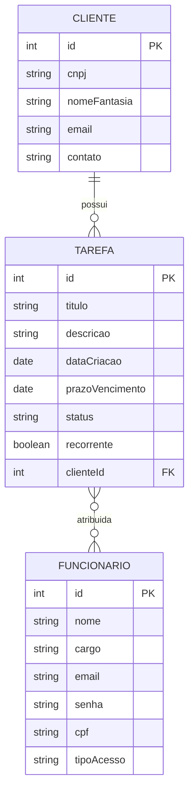

# Sistema de Gestão de Tarefas e Metas

API REST em Java + Spring Boot para gerenciamento de tarefas de uma equipe, com controle de prazos, recorrência mensal e histórico de conclusão.

## Contexto de negócio

Consultoria financeira precisa organizar tarefas contábeis (fixas e recorrentes) de sua equipe, atribuídas a clientes (empresas atendidas), com visão individual (funcionário) e gerencial (admin).

## Regras principais

- Apenas o administrador cadastra funcionários e cria tarefas.
- Funcionário comum só visualiza e conclui as próprias tarefas.
- Status da tarefa: `PENDENTE` ou `CONCLUIDA` (persistidos). "Atrasada" é calculado em tempo real no `Service`, comparando prazo com a data atual — não é salvo no banco.
- Tarefas recorrentes geram uma **nova linha** a cada ciclo (nunca sobrescrevem a anterior), preservando histórico para relatórios de desempenho.
- Uma tarefa pertence a um único cliente; pode ter um ou mais funcionários responsáveis.

## Modelagem (DER)



## Estrutura de pacotes

Organização por camada:

```
src/main/java/.../
├── controller/
├── service/
├── repository/
├── model/  (entidades)
└── dto/
```

## Tecnologias

- Java + Spring Boot
- Spring Data JPA
- Banco de dados relacional (a definir)
- Spring Security (autenticação)

## Status do projeto

🚧 Em desenvolvimento — modelagem concluída, definição de dependências em andamento.
